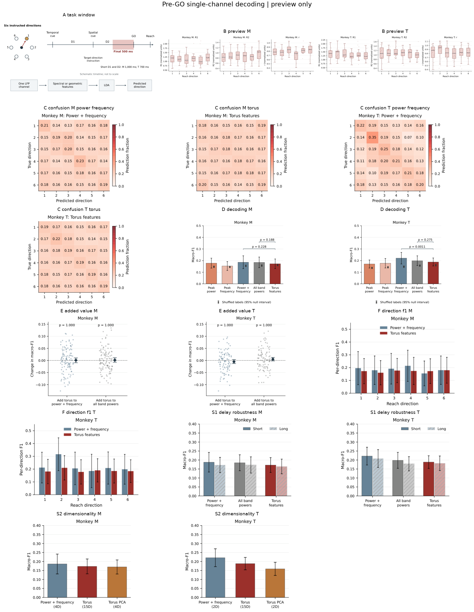

# Pre-GO Single-Channel Decoding

Main panels: short-delay, six-direction decoding from the final 500 ms before GO.
All panels are separate PDF, editable SVG, and 600-dpi PNG files. Use the PDF/SVG at their native size; labels are at least 8 pt.
Each has an underlying CSV and caption; D/E have additional test tables. Panel letters are not baked into the artwork.

## Cohort

Monkey M: 115 LFP recordings from 48 recording days, 13338 balanced trial observations; one animal.
Monkey T: 95 LFP recordings from 30 recording days, 12468 balanced trial observations; one animal.

Trial observations can include the same behavioral trial on different channels. No pseudopopulations, multichannel decoder, or cross-animal transfer.

## Timing Audit

The raw GO event (207) is at MATLAB sample 5001 for M and 4501 for T. The old converted metadata uses 4500 zero-based for both. This run uses the raw event table, giving M [4500:5000] and T [4000:4500]. Old results remain unchanged; old M timing needs a separate review.

## Individual Panels

| Artwork | PDF | SVG | PNG | Data | Caption |
|---|---|---|---|---|---|
| A_task_window | [PDF](panels/A_task_window.pdf) | [SVG](panels/A_task_window.svg) | [PNG](panels/A_task_window.png) | [CSV](panels/A_task_window.csv) | [Caption](panels/A_task_window.caption.txt) |
| B_geometry_M_R1 | [PDF](panels/B_geometry_M_R1.pdf) | [SVG](panels/B_geometry_M_R1.svg) | [PNG](panels/B_geometry_M_R1.png) | [CSV](panels/B_geometry_M_R1.csv) | [Caption](panels/B_geometry_M_R1.caption.txt) |
| B_geometry_M_R2 | [PDF](panels/B_geometry_M_R2.pdf) | [SVG](panels/B_geometry_M_R2.svg) | [PNG](panels/B_geometry_M_R2.png) | [CSV](panels/B_geometry_M_R2.csv) | [Caption](panels/B_geometry_M_R2.caption.txt) |
| B_geometry_M_r | [PDF](panels/B_geometry_M_r.pdf) | [SVG](panels/B_geometry_M_r.svg) | [PNG](panels/B_geometry_M_r.png) | [CSV](panels/B_geometry_M_r.csv) | [Caption](panels/B_geometry_M_r.caption.txt) |
| B_geometry_T_R1 | [PDF](panels/B_geometry_T_R1.pdf) | [SVG](panels/B_geometry_T_R1.svg) | [PNG](panels/B_geometry_T_R1.png) | [CSV](panels/B_geometry_T_R1.csv) | [Caption](panels/B_geometry_T_R1.caption.txt) |
| B_geometry_T_R2 | [PDF](panels/B_geometry_T_R2.pdf) | [SVG](panels/B_geometry_T_R2.svg) | [PNG](panels/B_geometry_T_R2.png) | [CSV](panels/B_geometry_T_R2.csv) | [Caption](panels/B_geometry_T_R2.caption.txt) |
| B_geometry_T_r | [PDF](panels/B_geometry_T_r.pdf) | [SVG](panels/B_geometry_T_r.svg) | [PNG](panels/B_geometry_T_r.png) | [CSV](panels/B_geometry_T_r.csv) | [Caption](panels/B_geometry_T_r.caption.txt) |
| B_preview_M | [PDF](panels/B_preview_M.pdf) | [SVG](panels/B_preview_M.svg) | [PNG](panels/B_preview_M.png) | [CSV](panels/B_preview_M.csv) | [Caption](panels/B_preview_M.caption.txt) |
| B_preview_T | [PDF](panels/B_preview_T.pdf) | [SVG](panels/B_preview_T.svg) | [PNG](panels/B_preview_T.png) | [CSV](panels/B_preview_T.csv) | [Caption](panels/B_preview_T.caption.txt) |
| C_confusion_M_power_frequency | [PDF](panels/C_confusion_M_power_frequency.pdf) | [SVG](panels/C_confusion_M_power_frequency.svg) | [PNG](panels/C_confusion_M_power_frequency.png) | [CSV](panels/C_confusion_M_power_frequency.csv) | [Caption](panels/C_confusion_M_power_frequency.caption.txt) |
| C_confusion_M_torus | [PDF](panels/C_confusion_M_torus.pdf) | [SVG](panels/C_confusion_M_torus.svg) | [PNG](panels/C_confusion_M_torus.png) | [CSV](panels/C_confusion_M_torus.csv) | [Caption](panels/C_confusion_M_torus.caption.txt) |
| C_confusion_T_power_frequency | [PDF](panels/C_confusion_T_power_frequency.pdf) | [SVG](panels/C_confusion_T_power_frequency.svg) | [PNG](panels/C_confusion_T_power_frequency.png) | [CSV](panels/C_confusion_T_power_frequency.csv) | [Caption](panels/C_confusion_T_power_frequency.caption.txt) |
| C_confusion_T_torus | [PDF](panels/C_confusion_T_torus.pdf) | [SVG](panels/C_confusion_T_torus.svg) | [PNG](panels/C_confusion_T_torus.png) | [CSV](panels/C_confusion_T_torus.csv) | [Caption](panels/C_confusion_T_torus.caption.txt) |
| D_decoding_M | [PDF](panels/D_decoding_M.pdf) | [SVG](panels/D_decoding_M.svg) | [PNG](panels/D_decoding_M.png) | [CSV](panels/D_decoding_M.csv) | [Caption](panels/D_decoding_M.caption.txt) |
| D_decoding_T | [PDF](panels/D_decoding_T.pdf) | [SVG](panels/D_decoding_T.svg) | [PNG](panels/D_decoding_T.png) | [CSV](panels/D_decoding_T.csv) | [Caption](panels/D_decoding_T.caption.txt) |
| E_added_value_M | [PDF](panels/E_added_value_M.pdf) | [SVG](panels/E_added_value_M.svg) | [PNG](panels/E_added_value_M.png) | [CSV](panels/E_added_value_M.csv) | [Caption](panels/E_added_value_M.caption.txt) |
| E_added_value_T | [PDF](panels/E_added_value_T.pdf) | [SVG](panels/E_added_value_T.svg) | [PNG](panels/E_added_value_T.png) | [CSV](panels/E_added_value_T.csv) | [Caption](panels/E_added_value_T.caption.txt) |
| F_direction_f1_M | [PDF](panels/F_direction_f1_M.pdf) | [SVG](panels/F_direction_f1_M.svg) | [PNG](panels/F_direction_f1_M.png) | [CSV](panels/F_direction_f1_M.csv) | [Caption](panels/F_direction_f1_M.caption.txt) |
| F_direction_f1_T | [PDF](panels/F_direction_f1_T.pdf) | [SVG](panels/F_direction_f1_T.svg) | [PNG](panels/F_direction_f1_T.png) | [CSV](panels/F_direction_f1_T.csv) | [Caption](panels/F_direction_f1_T.caption.txt) |
| S1_delay_robustness_M | [PDF](panels/S1_delay_robustness_M.pdf) | [SVG](panels/S1_delay_robustness_M.svg) | [PNG](panels/S1_delay_robustness_M.png) | [CSV](panels/S1_delay_robustness_M.csv) | [Caption](panels/S1_delay_robustness_M.caption.txt) |
| S1_delay_robustness_T | [PDF](panels/S1_delay_robustness_T.pdf) | [SVG](panels/S1_delay_robustness_T.svg) | [PNG](panels/S1_delay_robustness_T.png) | [CSV](panels/S1_delay_robustness_T.csv) | [Caption](panels/S1_delay_robustness_T.caption.txt) |
| S2_dimensionality_M | [PDF](panels/S2_dimensionality_M.pdf) | [SVG](panels/S2_dimensionality_M.svg) | [PNG](panels/S2_dimensionality_M.png) | [CSV](panels/S2_dimensionality_M.csv) | [Caption](panels/S2_dimensionality_M.caption.txt) |
| S2_dimensionality_T | [PDF](panels/S2_dimensionality_T.pdf) | [SVG](panels/S2_dimensionality_T.svg) | [PNG](panels/S2_dimensionality_T.png) | [CSV](panels/S2_dimensionality_T.csv) | [Caption](panels/S2_dimensionality_T.caption.txt) |

## Audit Tables

- [Held-out predictions](tables/heldout_predictions.csv)
- [Recording scores](tables/recording_scores.csv)
- [Mean and SD summaries](tables/summary.csv)
- [All eight planned comparisons](tables/planned_comparisons.csv)
- [Recording eligibility and GO audit](tables/recording_audit.csv)
- [Example selection](tables/example_selection.csv)
- [Training-fold embedding selections](tables/embedding_selection.csv)
- [Feature-fit exclusions](tables/exclusions_geometry.csv)
- [Failed trial fits retained via training-median imputation](tables/fit_failures.csv)
- [Numerical/export validation](validation.json)
- [Methods, source references, and reproduction commands](../../PREGO_ANALYSIS.md)

Fold-specific feature CSVs, model-selection metadata, and trial IDs are under cache/<recording>/<analysis>/.
The filename 'short' means the primary cohort. 'matched_short' and 'matched_long' are S1 only.

## Interpretation

Macro-F1 is averaged across six direction-specific F1 values. Confusion diagonals are recall, not F1. D/F and supporting bars show recording means and SDs. E shows actual paired recording differences with day-cluster bootstrap confidence intervals. Planned p values use paired day means and Holm correction across eight tests. Null intervals are shuffled-label references, not statistical tests against 1/6.

This adapts the 2012 peak-power/frequency representation, not the original population LVQ decoder or its accuracy benchmark. The descriptive examples are selected by label-blind fit error, never decoding scores.

## Preview

The contact sheet is for navigation only; the standalone files above are the manuscript deliverables.

